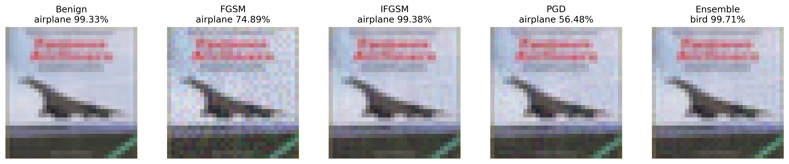

# Adversarial Attacks on CIFAR-10

# Abstract

Deep neural networks are known to be vulnerable to adversarial examples.
This project investigates the transferability of gradient-based adversarial attacks across
different CNN architectures on CIFAR-10.

We implement several classical attacks including FGSM, I-FGSM, and PGD, and evaluate their
effectiveness in a black-box setting using surrogate models.
We further explore an ensemble attack strategy to improve transferability.

Experimental results show that ensemble-based adversarial examples significantly reduce the
accuracy of the target model.


# Results
Adversarial examples are generated using surrogate models and evaluated on the target model (ResNet110).
| Setting | Attack | Surrogate Model | Target Model | Accuracy | Loss |
|--------|------|----------------|--------------|---------|------|
| Clean | None | - | ResNet110 | **0.95000** | 0.22678 |
| Attack | FGSM | ResNet56 | ResNet110 | 0.65000 | 1.88393 |
| Attack | FGSM | DenseNet40 | ResNet110 | 0.65000 | 1.85999 |
| Attack | FGSM | WRN28 | ResNet110 | 0.74000 | 1.39888 |
| Attack | I-FGSM | ResNet56 | ResNet110 | 0.32000 | 4.52877 |
| Attack | I-FGSM | DenseNet40 | ResNet110 | 0.64000 | 1.87941 |
| Attack | I-FGSM | WRN28 | ResNet110 | 0.67500 | 1.78542 |
| Attack | PGD | ResNet56 | ResNet110 | 0.43000 | 3.67697 |
| Attack | PGD | DenseNet40 | ResNet110 | 0.66000 | 1.72951 |
| Attack | PGD | WRN28 | ResNet110 | 0.66500 | 1.83135 |
| Attack | Ensemble | ResNet56 + DenseNet40 + WRN28 | ResNet110 | **0.29000** | 4.99305 |


As above, the ensemble attack produces stronger adversarial examples and significantly reduces model accuracy.


# Attack Visulization
Examples of adversarial images generated by different attack methods.



# Dataset

A small subset of the CIFAR-10 validation set is used for demonstration purposes.

- 10 classes
- 20 images per class
- Total: **200 images**

Classes include:

- airplane
- automobile
- bird
- cat
- deer
- dog
- frog
- horse
- ship
- truck


# Models

Pretrained models from **pytorchcv** are used.

## Target model

- **ResNet110**

## Surrogate models (for transfer attack)

- ResNet56
- DenseNet40_k12
- WideResNet28-10

The surrogate models are used to generate transferable adversarial examples.


# Attack Methods

We implement the following adversarial attack algorithms.

## FGSM

Fast Gradient Sign Method:

$$
x_{adv} = x + \epsilon \cdot sign(\nabla_x L(x,y))
$$


## I-FGSM

Iterative version of FGSM with multiple small updates.

$$
x_{0} = x 
$$ 

$$
x_{t+1} =
\text{clip}_{x,\epsilon}
\left(
x_t + \alpha \cdot \text{sign}(\nabla_x L(x_t,y))
\right)
\quad t = 0,...,T−1
$$


## PGD

Projected Gradient Descent attack with iterative updates and projection into the ε-ball.

$$
x_{0} = x +\delta, \quad \delta \sim \mathcal{U}(-\epsilon, \epsilon) 
$$ 

$$
x_{t+1} = \Pi_{B_{\epsilon(x)}}(x_t + \alpha \cdot \text{sign}(\nabla_x L(x_t,y))) 
\quad t=0,...,T-1
$$


## Ensemble Attack

Instead of attacking a single model, gradients from multiple surrogate models are combined to generate adversarial examples.

This improves **transferability** to the target model.


# Implementation

The project is implemented using **PyTorch**.

Main components include:

- loading pretrained models from `pytorchcv`
- implementing gradient-based adversarial attacks
- generating adversarial examples
- evaluating transferability across models


# Requirements
- Python >= 3.10

Install dependencies:

```bash
pip install -r reuirements.txt
```

# Repository Structure
```
.
├── adversarial_attack.ipynb
├── requirements.txt
├── README.md
├── images/
│   └── example_attack.png
└── .gitignore
```

# Discussion

From the experimental results we observe:

- Iterative attacks (I-FGSM, PGD) may not be stronger than single-step attacks such as FGSM in Black-box attack.
- Adversarial examples generated from surrogate models can transfer to other architectures. (the adversarial examples generated from surrogate models can also decrease the accuracy of target model)
- The ensemble attack significantly reduces model accuracy, demonstrating improved attack transferability.


